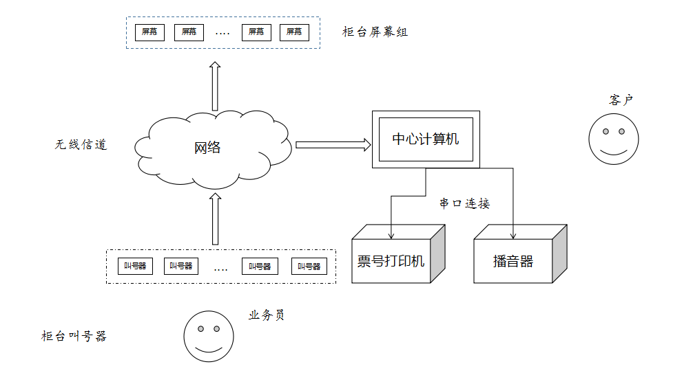

### 排队机软件说明 create by siwanghu v1.0  
# 系统架构  
>   
>  
> ## **架构说明**  
> 硬件分为:1.无线屏幕 &nbsp;&nbsp;2.无线叫号器 &nbsp;&nbsp;3.票据打印机 &nbsp;&nbsp;4.播音器 &nbsp;&nbsp;5.计算机  
>  
> **1.屏幕、叫号器与计算机采用无线网络进行数据交换，极大方便排队系统的硬件部署**  
> **2.票号打印机和播音器采用串口与计算机连接**  
# 软件说明  
> ## 1.采用C# .net技术实现  
> ## 2.硬件操作采用C++封装dll本地库，C#程序调用dll库  
> ## 3.可以通过xml配置文件指定软件运行  
> ## 4.支持高并发操作
# 运行说明  
> VS2015打开Bank文件，直接运行即可  
> **必须要配置configure.xml文件，该文件放在源代码目录下，主要是关于界面的动态显示，硬件参数，网络地址的配置**  
> *配置方法在configure.xml文件中有详细注释*